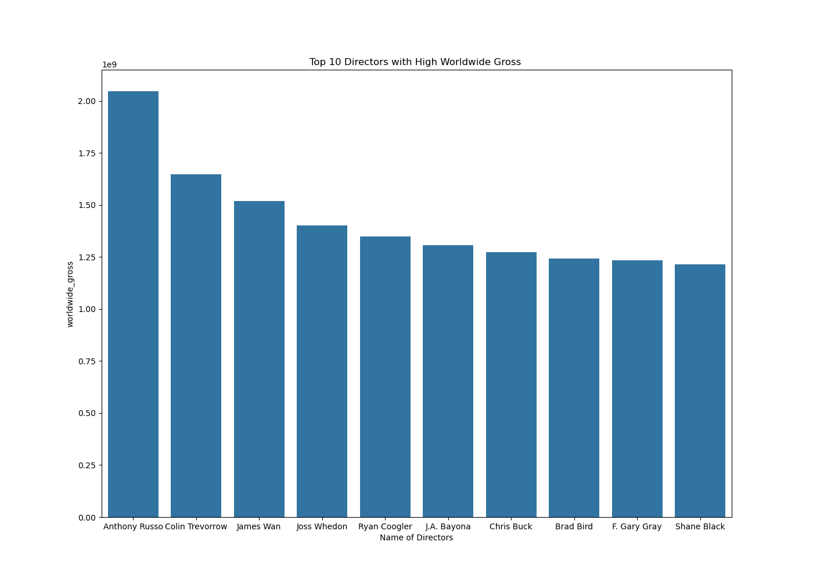
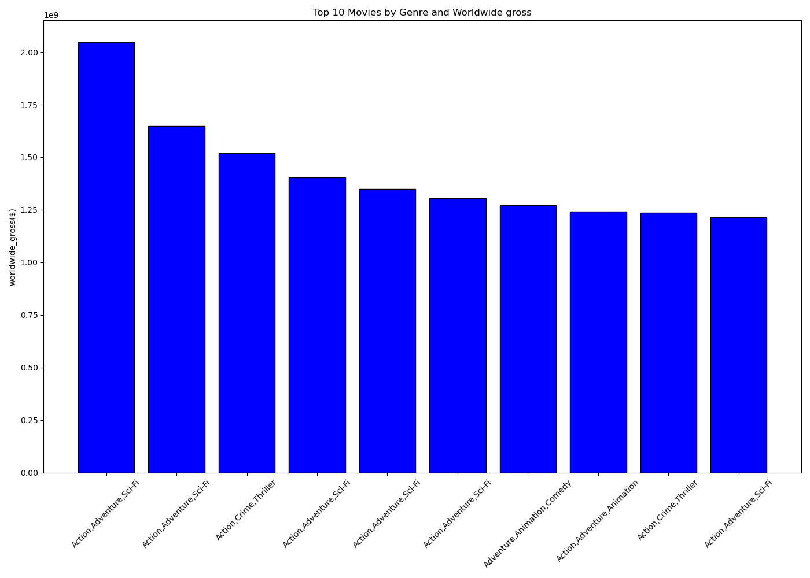
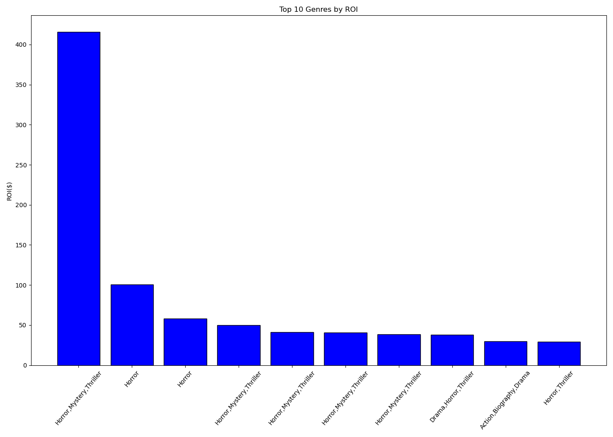
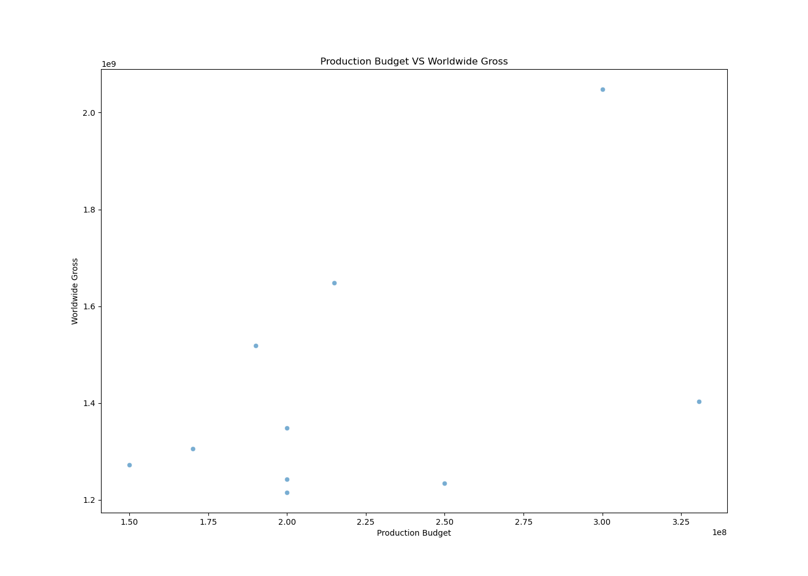

# Phase 2 Project README.md
## Business Problem.

Your company now sees all the big companies creating original video content and they want to get in on the fun. They have decided to create a new movie studio, but they don’t know anything about creating movies. You are charged with exploring what types of films are currently doing the best at the box office. You must then translate those findings into actionable insights that the head of your company's new movie studio can use to help decide what type of films to create.

## Overview.
- Data used was bom.movie_gross.csv, tn.movie_budgets.csv and im.db.
- The release_date was converted to date-time format with error handling.
- The revenue columns that include worldwide_gross, production_budget, foreign_gross and domestic-gross Were converted to numerical values.
- ROI was done by subtracting production_budget from worldwide_gross and dividing it by production budget(worldwide_gross - production_budget / production_budget).
- Merged bom.movie_gross.csv(df_bom) and tn.movie_budgets.csv(df_budget) with release_date and movie columns after converting release_date to date time format and renaming the column title in df_bom to movie.
- Extracted Year from the release_date using (.dt.year) into a Year column.
- Merged df_bom and df-budget and called it merged_2.
- Then merged the merged_2 to the im.db database using the tables movie_basics(df_basics), movie_ratings(df_ratings), Directors(df_directors), Persons(df_persons).
- Used release_date column that was renamed from start_year to release_date and movie column that was renamed from movie to primary_title in df_basics to merge df_basics and merged_2 and called the data-set merged_dataset
- Used movie_id in df_ratings and merged it with merged_dataset and called it merged_dataset1 using an inner join.
- used movie_id in df_directors and merged it with merged_dataset1 and called it merged_dataset2 using left join.
- Used person_id in df_persons and merged it with merged_dataset2 and called it merged_dataset3 using left join.
- Dropped original_title column and used primary_title and release_date to drop duplicated values, this in turn gave the final dataset called final that has 1025 rows and 17 columns.
- Computed top 10 primary_title and genres with the highest worldwide_gross, production budegt, foreign_gross and domestic_gross  and displayed a horizintal bar chart, also, grouped the revenues by priamry_title, release_date, genres and directors.
- Found the correlation between production budget and worlwide_gross.
- Found the primary_title with the highest Return On Investment.
## Business Understanding.
### StakeHolders.
From the analysis done the stake-holders are identified and their roles or intersts are shown as follows:
- Studio Executives or Investors - Wants to maximize ROI from the films.
- Producers and Production managers - Need to understand budget thresholds that lead to profitable outcome.
- Marketing Team - Interested in knowing which genres, budgets or directors tend to generate more revenue.
- Audience(external stake-holder)- determines part of the revenue the films generate.
### Key Business Questions.
The questions the anlysis helps us to answer are:
- What is the correlation between production_budget and worldwide_gross?
- Which movie genres do the best?
- Which Directors bring in more revenue?
- Which primary_title and genres have the highest production budget?
- Top 10 genres by domestic and foreign gross?
## Data Understanding and analysis.
- The main data-sets used are bom.movie_gross.csv, tn.movie_budgets.csv and im.db.
- The structure of the data is represented by primary_title, release_date, Directors,persons and genres columns involving worldwide_gross, production_budget, domestic_gross, foreign_gross and ROI.
- Key columns used in the analysis are release_date, primary_tiltle, genres, directors, worldwide_gross, production_budget, domestic_gross, foreign_gross and ROI.
- There are missing values in the data-set which are cleaned by using fillna('None') and dropping the missing values. Columns like birth_year, death_year and original_title are dropped entirely from the data-set. 
### Data Cleaning Performed.
- Converted release_date using pd.to_datetime.
- Extracted year using .dt.year.
- Converted worldwide_gross, production_budget, domestic_gross, foreign_gross columns to numeric using pd.to_numeric.
- Created a derived column ROI by (worldwide_gross - production_budget / production_budget).
- Dropped columns with many missing values.
- Sorted values and grouped by. 
### Data Analysis.
Data was explored and patterns were created:
#### Top 10 genres.
The analysis was done by production_budget, worldwide_gross and ROI:

#### Trend Analysis.
The analysis was done by ROI to show correlation of two variables(production_budget and worldwide-gross):

## Summary.
- A correlation of 0.78 was observed between production_budget and worldwide_gross.
- Movies in genres like Horror showed higher return of investment, even with lower production budget.
- Certain directors with high numvotes, generally bring in a higher worldwide_gross.

### Relevant findings:
#### Higher Budget Higher Returns:
Bigger budgets tend to yield higher worldwide_gross as seen in the data. This is shown by the Return On Investment.
#### Genres also equate to profitability:
Genres like Horror had a high ROI even with modest or low production_budget. This is cost effective for New Movie Studio that is aiming to venture in the industry.
#### Director influence:
Directors with high numvotes tend to bring in a higher worldwide_gross. New Movie Studio will benefit immensely by choosing experienced or audience-approved Directors.

## Final Insight:
A strategic combination of modest budget_production in ROI e.g in genres like Horror and directed by well-rated or experienced directors, offers the most cost-effective path to profitablity that should be ventured by New Movie Studio.

[👉 View the Live Dashboard on Tableau](https://public.tableau.com/app/profile/valerie.kigo/viz/MovieAnalysis_17542728958790/Dashboard1?publish=yes)

